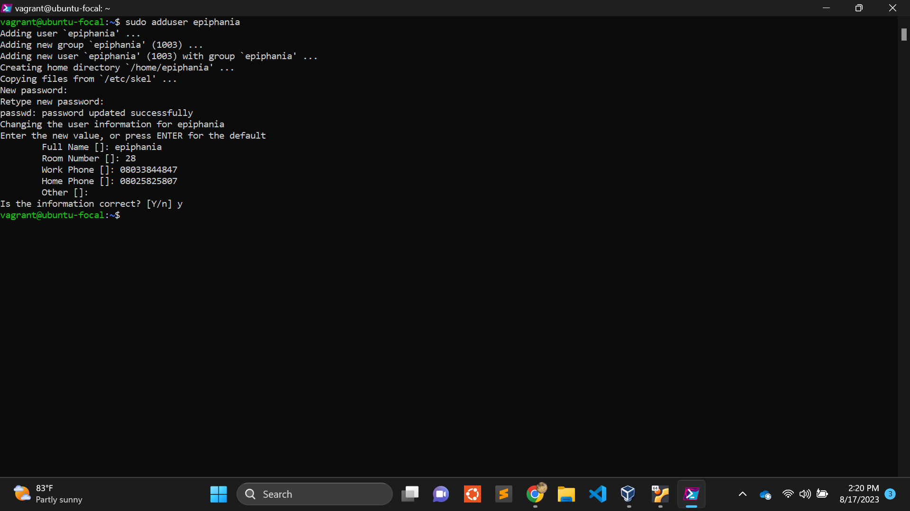

# Linux command assignment
## create a user
to create a user on linux we use the command *sudo adduser username*

create a user
. set an expiry date of 2weeks for the user
. prompt the user to change there password on login
. attach the user to a group called altschool
. allow altschool group to be able to run only cat command on /etc/
. create another user. make sure that this user doesn't have a home directory.
